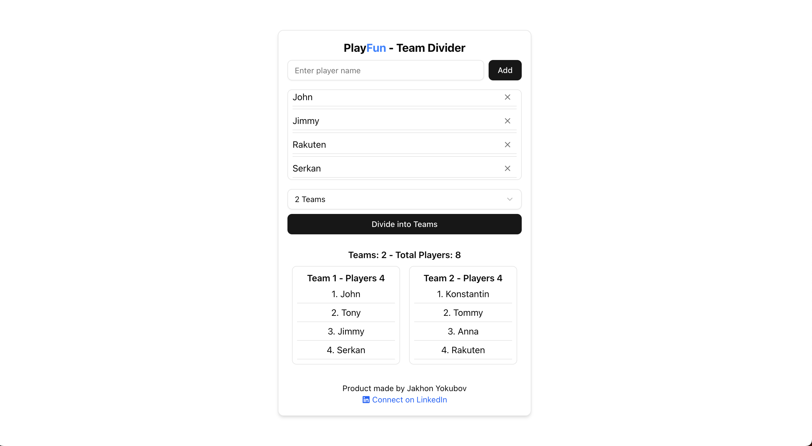

# 🎲 PlayFun

## 🚀 Live Website
Experience the app live:  
https://player-picker.vercel.app/

---

## 📸 Screenshots  
### **Home Page:** 
 

PlayFun is a web application that allows users to add players and randomly divide them into teams. It supports up to 4 teams, provides a smooth and mobile-friendly UI, and includes a sliding table for easy team viewing.

## 🚀 Features

- ✅ Add and manage player names dynamically.
- ✅ Randomly divide players into up to 4 teams.
- ✅ Interactive slider for viewing team assignments.
- ✅ Mobile-friendly, responsive design.
- ✅ Beautiful UI with smooth transitions.
- ✅ Metadata optimized for social media sharing (Facebook, Twitter, Telegram).

## 🛠️ Tech Stack

- **Frontend:** Next.js, React, TypeScript, Tailwind CSS
- **UI Components:** ShadCN UI
- **Deployment:** Vercel

